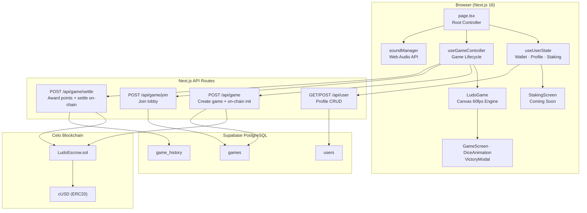
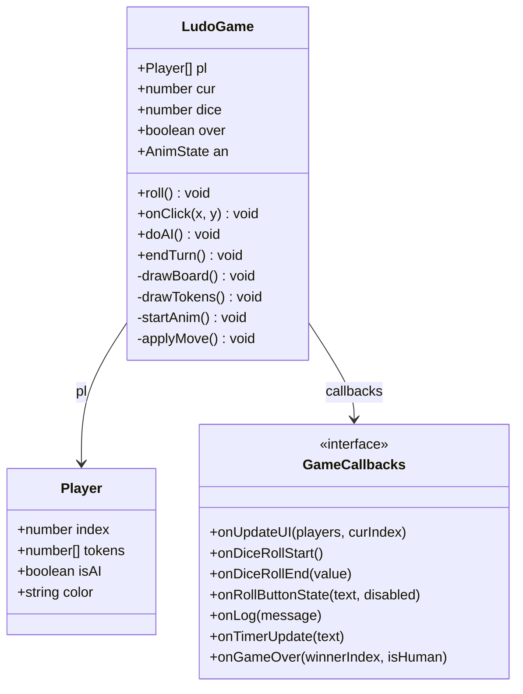
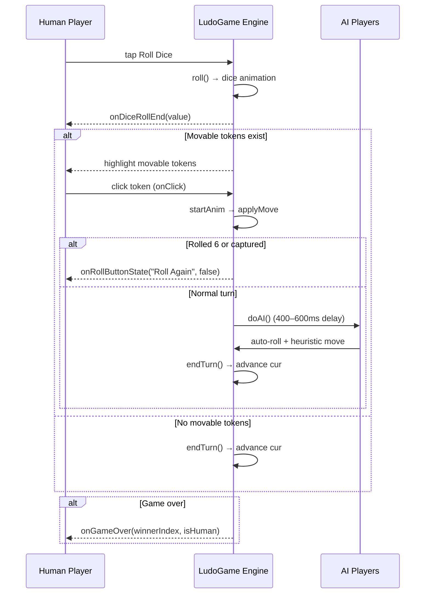
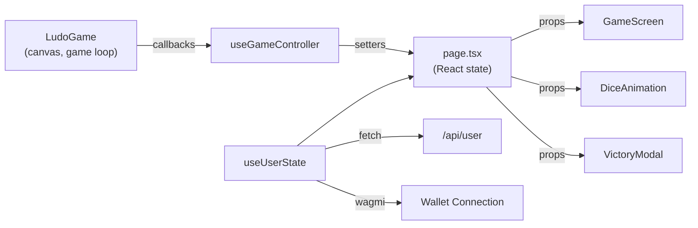
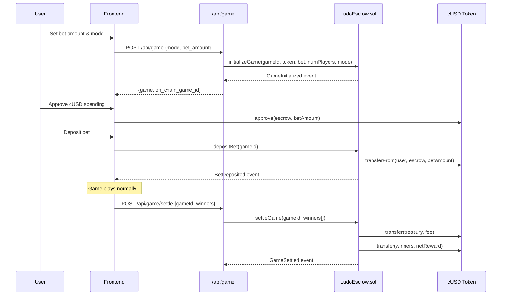
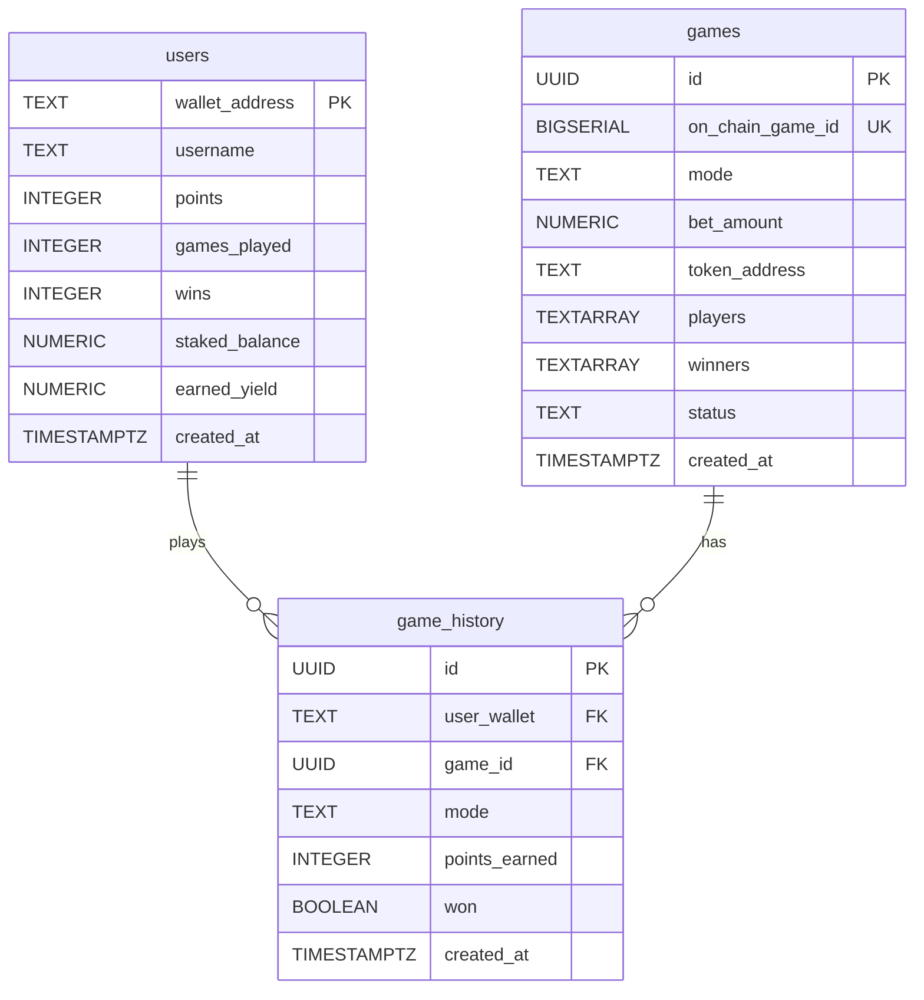
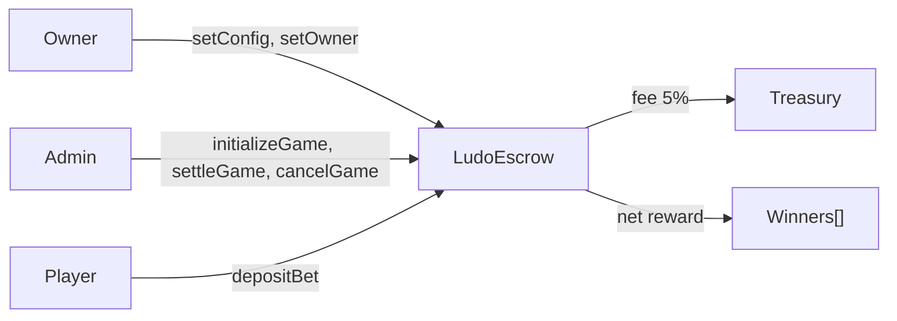
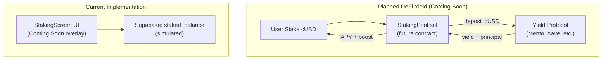

# Celudo — Architecture Reference

## System Overview



---

## Game Engine



### Token Position Encoding

| Range | Meaning |
|-------|---------|
| `-1` | Home base (off track) |
| `0` | Just entered track (at start cell) |
| `1–50` | Main track |
| `51` | Last track cell (home entry) |
| `52–56` | Home stretch (5 cells) |
| `57` | Finished (center) |

### Safe Cells

Absolute track positions `[0, 8, 13, 21, 26, 34, 39, 47]` — no captures allowed.

### Win Condition

First player to move all 4 tokens to position `57` (center) wins the game.

### Capture Rule

When a token lands on a cell occupied by an opponent (and that cell is not a safe cell), the opponent token returns to home base (`pos = -1`). The capturing player receives a bonus roll.

---

## Turn Flow



---

## State Management



- **`useGameController`** — Instantiates `LudoGame` when `currentView === "game"`, bridges game callbacks to React state. Handles game-over scoring and API calls.
- **`useUserState`** — Manages wallet connection (Wagmi), user profile (Supabase), staking balance, points, tier calculation. Provides `effectiveAddress` for both real wallets and demo mode.

---

## Cash Bet Flow



---

## Database Schema



### Mobile Status Values

| Status | Meaning |
|--------|---------|
| `waiting` | Lobby open, waiting for players |
| `active` | Game in progress |
| `settled` | Game finished, prizes distributed |
| `cancelled` | Game cancelled, refunds issued |

### Game Modes

| Mode | Players | Base Points | Win Bonus |
|------|---------|-------------|-----------|
| `free` | 2–4 | 10 | +25 |
| `solo` | 2 | 5 | +10 |
| `duo` | 4 (2v2) | 8 | +15 |
| `4player` | 4 | 10 | +25 |
| `tournament` | 4+ | 20 | +100 |

---

## Smart Contract: LudoEscrow.sol



### Key Functions

| Function | Caller | Purpose |
|----------|--------|---------|
| `initializeGame(gameId, token, bet, numPlayers, mode)` | Admin/Owner | Register game on-chain |
| `depositBet(gameId)` | Player wallet | Transfer bet into escrow |
| `depositBetFor(gameId, player)` | Admin/Owner | Deposit on behalf of bot/sponsor |
| `settleGame(gameId, winners[])` | Admin | Distribute pot minus 5% fee |
| `cancelGame(gameId)` | Admin/Owner | Refund all deposited players |
| `setConfig(admin, treasury, feeBps)` | Owner | Change admin/fee settings |

### Fee Structure

Default treasury fee: **5%** (500 bps). Max cap: **20%** (2000 bps). Remainder split equally among `winners[]`.

---

## Board Layout (15x15 Grid)

```
Col:  0  1  2  3  4  5  6  7  8  9 10 11 12 13 14
Row 0:[R][R][R][R][R][R][  ][  ][  ][B][B][B][B][B][B]
Row 1:[R][R][R][R][R][R][  ][B↓][  ][B][B][B][B][B][B]
Row 2:[R][R][●][●][R][R][  ][B↓][  ][B][B][●][●][B][B]
Row 3:[R][R][●][●][R][R][  ][B↓][  ][B][B][●][●][B][B]
Row 4:[R][R][R][R][R][R][  ][B↓][  ][B][B][B][B][B][B]
Row 5:[R][R][R][R][R][R][  ][B↓][  ][B][B][B][B][B][B]
Row 6:[  ][R→][  ][  ][  ][  ][  ][  ][  ][  ][  ][  ][  ][Y←][  ]
Row 7:[  ][R→][R→][R→][R→][R→][R→][★][Y←][Y←][Y←][Y←][Y←][Y←][  ]
Row 8:[  ][  ][  ][  ][  ][  ][  ][  ][  ][  ][  ][  ][  ][  ][  ]
Row 9:[G][G][G][G][G][G][  ][G↑][  ][Y][Y][Y][Y][Y][Y]
Row10:[G][G][●][●][G][G][  ][G↑][  ][Y][Y][●][●][Y][Y]
Row11:[G][G][●][●][G][G][  ][G↑][  ][Y][Y][●][●][Y][Y]
Row12:[G][G][G][G][G][G][  ][G↑][  ][Y][Y][Y][Y][Y][Y]
Row13:[G][G][G][G][G][G][  ][G↑][  ][Y][Y][Y][Y][Y][Y]
Row14:[G][G][G][G][G][G][  ][  ][  ][Y][Y][Y][Y][Y][Y]

Legend:
  G = Green home (bottom-left)    R = Red home (top-left)
  B = Blue home (top-right)       Y = Yellow home (bottom-right)
  ● = Token home-base circle slots
  ★ = Center (win)
  → ← ↑ ↓ = Home stretch corridors
  [ ] = Main track cell
```

### Color Assignment

| Player | Color | Home Area | Start Cell | Home Entry |
|--------|-------|-----------|------------|------------|
| 0 | Green | Bottom-left | `[6,13]` | `TK[51]=[8,12]` → `[7,12]` |
| 1 | Red | Top-left | `[0,6]` | `TK[12]=[0,7]` → `[1,7]` |
| 2 | Blue | Top-right | `[7,0]` | `TK[25]=[6,0]` → `[7,1]` |
| 3 | Yellow | Bottom-right | `[14,6]` | `TK[38]=[13,6]` → `[13,7]` |

---

## DeFi Yield — COMING SOON

The staking/yield feature currently displays a **Coming Soon** overlay. The real DeFi integration is planned as:



**Current state**: StakingScreen shows APY breakdown and tier boosts, but all values are simulated. `handleStake()` updates React state and syncs to Supabase — no on-chain interaction.

**Planned state**: A `StakingPool.sol` contract that accepts cUSD deposits, routes them to a Celo yield protocol, and distributes real yield to stakers with tier-based APY boosts.

---

## API Routes

| Method | Route | Purpose |
|--------|-------|---------|
| `POST` | `/api/game` | Create game lobby (+ on-chain init for cash bets) |
| `GET` | `/api/game` | List open games |
| `POST` | `/api/game/join` | Player joins a lobby |
| `POST` | `/api/game/settle` | End game: award points, settle on-chain |
| `GET` | `/api/user?wallet=` | Fetch or upsert user profile |
| `POST` | `/api/user` | Update user stats |

---

## Sound System

Implemented in `src/lib/sound.ts` using the **Web Audio API** (no audio files). All sounds are synthesized:

- **BGM**: A minor pentatonic melody loop + bass drone
- **Token move**: Ascending tone (E4→B4)
- **Capture**: Harsh sawtooth chord
- **Win fanfare**: Rising arpeggio

Controlled by `soundManager.toggle()` and `soundManager.toggleBGM()`.

---

## Deployment

### Dual Network Configuration

The app supports both Alfajores testnet and Celo mainnet via the `NEXT_PUBLIC_NETWORK` environment variable:

| Variable | Alfajores (Testnet) | Celo (Mainnet) |
|----------|-------------------|---------------|
| `NEXT_PUBLIC_NETWORK` | `testnet` | `mainnet` |
| `NEXT_PUBLIC_CELO_RPC_URL` | `https://alfajores-forno.celo-testnet.org` | `https://forno.celo.org` |
| `NEXT_PUBLIC_ESCROW_CONTRACT_ADDRESS` | Deployed testnet address | Deployed mainnet address |
| `NEXT_PUBLIC_USDM_ADDRESS` | `0x874069Fa1Eb16D44d622F2e0Ca25eeA172369bC1` | `0x765DE816845861e75A25fCA122bb6898B8B1282a` |

The Wagmi config in `src/lib/wagmi.ts` includes both chains and switches based on the active network.

### Contract Deployment

```bash
# Deploy to Alfajores testnet
cd contract
forge script script/Deploy.s.sol --rpc-url https://alfajores-forno.celo-testnet.org --broadcast

# Deploy to Celo mainnet
forge script script/Deploy.s.sol --rpc-url https://forno.celo.org --broadcast
```

After deployment, update `.env.local` with the deployed contract address.