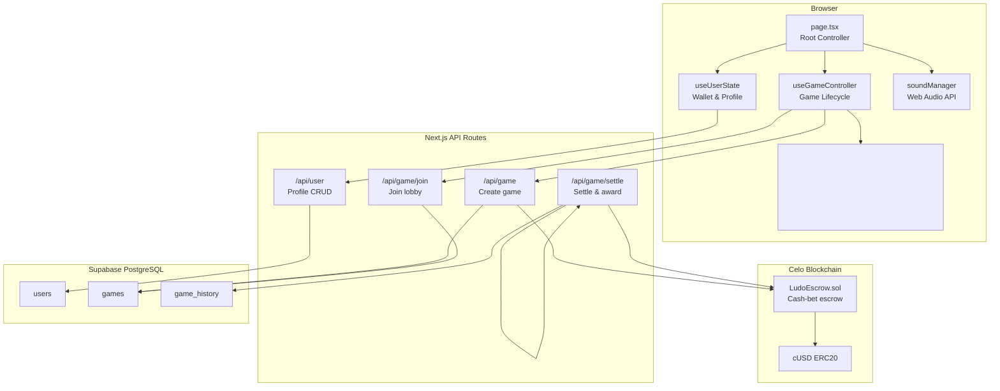

# Celudo — Play Ludo, Boost Your Yield

Play-to-earn Ludo on Celo. Stake cUSD, play against AI or other players, accumulate tournament points that boost your staking APY. Games can be free, tournament, or cash-bet (on-chain escrow).

## Architecture



## Tech Stack

| Layer | Technology |
|-------|-----------|
| Frontend | Next.js 16 + React 19 + TypeScript 5 |
| Styling | Tailwind CSS 4 + shadcn/ui |
| Animation | Framer Motion 12 |
| Web3 | Wagmi 3 + Viem 2 + Ethers.js 6 |
| Database | Supabase (PostgreSQL) |
| Blockchain | Celo (Alfajores testnet + Mainnet) |
| Smart Contracts | Foundry (Solidity) |
| Audio | Web Audio API (synthesized, no samples) |

## Prerequisites

- Node.js 20+
- npm 10+
- Foundry (for smart contract work)
- A Celo wallet (MetaMask or MiniPay)
- Supabase project

## Quick Start

```bash
# Clone and install
git clone <repo-url> && cd celudo
npm install

# Configure environment
cp .env.example .env.local
# Edit .env.local with your Supabase and contract addresses

# Start dev server
npm run dev
```

Open [http://localhost:3000](http://localhost:3000).

## Environment Variables

| Variable | Description | Example |
|----------|-------------|---------|
| `NEXT_PUBLIC_NETWORK` | `testnet` or `mainnet` | `testnet` |
| `NEXT_PUBLIC_SUPABASE_URL` | Supabase project URL | `https://xxx.supabase.co` |
| `NEXT_PUBLIC_SUPABASE_ANON_KEY` | Supabase anon key | `eyJ...` |
| `SUPABASE_SERVICE_ROLE_KEY` | Supabase service role (server-only) | `eyJ...` |
| `NEXT_PUBLIC_ESCROW_CONTRACT_ADDRESS` | Deployed LudoEscrow address | `0x...` |
| `NEXT_PUBLIC_USDM_ADDRESS` | cUSD token address | `0x765DE...` (mainnet) |
| `ADMIN_PRIVATE_KEY` | Backend wallet key (server-only) | `0x...` |
| `ADMIN_ADDRESS` | Backend wallet address | `0x...` |
| `TREASURY_ADDRESS` | Fee recipient address | `0x...` |
| `CELOSCAN_API_KEY` | Celoscan API key for verification | `abc...` |

See `.env.example` for dual testnet/mainnet configuration.

## Scripts

```bash
npm run dev      # Start Next.js dev server
npm run build   # Production build + type check
npm run lint    # ESLint
```

### Smart Contracts (Foundry)

```bash
cd contract
forge build                  # Compile contracts
forge test                   # Run tests
forge script script/Deploy.s.sol \
  --rpc-url $RPC_URL \
  --broadcast                # Deploy to network
```

## Project Structure

```
src/
├── app/
│   ├── ludoEngine.ts          # Core Ludo game logic + canvas rendering
│   ├── page.tsx               # Root app controller, view routing
│   ├── layout.tsx             # Root layout, fonts, providers
│   ├── globals.css            # Pirate theme + Tailwind
│   └── api/
│       ├── game/route.ts      # Create game
│       ├── game/join/route.ts # Join game lobby
│       ├── game/settle/route.ts # Settle game, award points
│       └── user/route.ts      # User profile CRUD
├── components/
│   ├── game/                  # GameScreen, DiceAnimation, VictoryModal
│   ├── home/                  # HomeScreen
│   ├── lobby/                 # LobbyScreen
│   ├── profile/               # ProfileScreen
│   ├── staking/               # StakingScreen
│   └── ui/                    # Header, BottomNav, shared components
├── hooks/
│   ├── useGameController.ts   # Game lifecycle, state sync to UI
│   ├── useUserState.ts        # Wallet, points, tiers, staking
│   └── useToast.ts            # Toast notification system
└── lib/
    ├── sound.ts               # Web Audio BGM + SFX (synthesized)
    ├── wagmi.ts               # Wagmi config (Celo chains, connectors)
    ├── supabase.ts            # Supabase client
    └── utils.ts               # cn() utility

contract/
├── src/LudoEscrow.sol         # Escrow contract for cash-bet games
├── test/LudoEscrow.t.sol      # Contract tests
└── script/Deploy.s.sol        # Deployment script

supabase/
└── migrations/                # Database migrations
```

## Smart Contract

`LudoEscrow.sol` handles cash-bet game escrow on Celo:

- **Admin** creates games (`initializeGame`)
- **Players** deposit cUSD (`depositBet`)
- **Admin** settles and distributes prizes (`settleGame`), 5% treasury fee
- **Admin/Owner** can cancel and refund (`cancelGame`)

Deployed addresses are configured via environment variables. See `contract/` for source and tests.

## Game Rules

- 4 players, 4 tokens each, standard Ludo rules
- Roll 6 to enter the board; roll 6 gives an extra turn
- Capture opponent tokens on non-safe cells; capture grants bonus roll
- Safe cells: `[0, 8, 13, 21, 26, 34, 39, 47]`
- First player to get all 4 tokens to center wins
- AI opponents use a heuristic: prioritize captures > home stretch > most advanced

## Tier System

| Tier | Min Points | APY Boost | Perk |
|------|-----------|-----------|------|
| Bronze | 100 | +0.5% | Basic dice |
| Silver | 500 | +1.0% | Priority queue |
| Gold | 2,000 | +2.0% | Tournament priority |
| Diamond | 10,000 | +3.0% | NFT airdrops |
| Legend | 50,000 | +5.0% | Revenue share |

## Contributing

This project follows an **atomic commit** workflow. Each PR should contain a single, small, self-contained change:

1. Create a feature branch: `git checkout -b feat/short-description`
2. Make one logical change per commit
3. Write clear commit messages: `feat: add X`, `fix: resolve Y`, `docs: update Z`
4. Open a small, focused PR

See `tasks.md` for the current task breakdown and phases.

## License

MIT